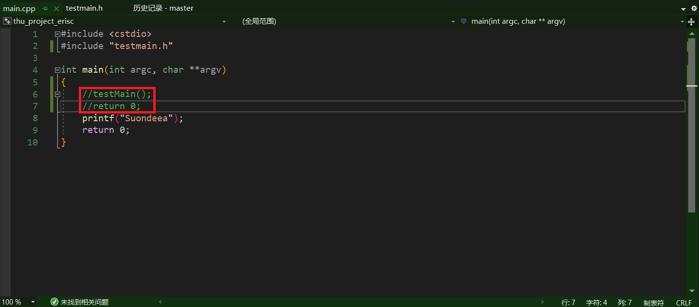
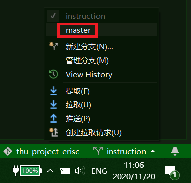
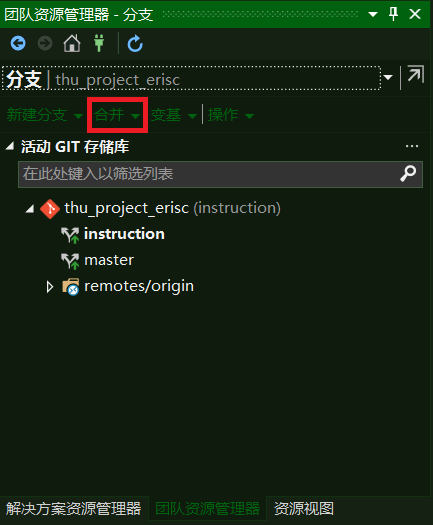

# 使用git的工作流程

## 第一步：新建分支

* 点击`团队资源管理器`中的`分支`

  

* 新建分支

  

* 把分支名设为与自己正在进行的工作有关的名称

  

* 把该分支推送到远程存储库

  

* 完成你的任务并提交，同步

* 若需要对自己编写的文件进行debug，请按照以下步骤：

  * 取消对`main.cpp`的`main`函数中下列代码的注释

    

  * 在`testmain.cpp`中的`testMain`函数中进行编辑

  * 确认排除所有bug后，将`main.cpp`的`main`函数中上述代码恢复注释

* 完成自己的工作并完成debug后，提交并同步自己的更改

* 切换回`master`分支

  

* 回到`团队资源管理器`的`分支`视图，选择`合并`

  

* 